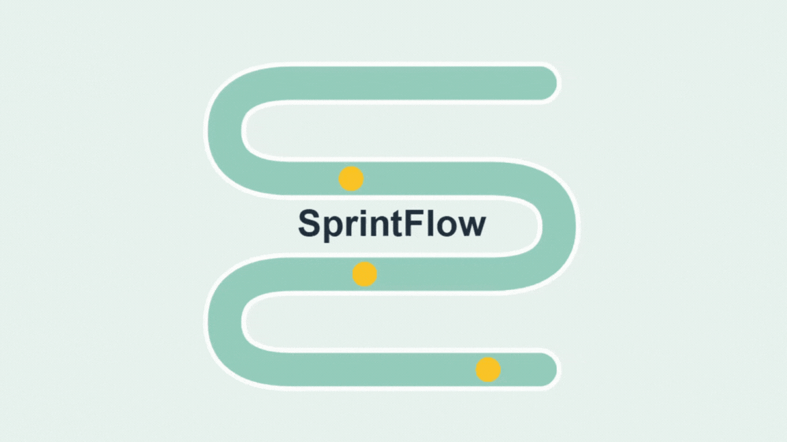

# 🟢 SprintFlow - Cliente (Frontend)

<div align="center">
  
</div>

## 📜 Descripción
SprintFlow es una **aplicación web para la gestión ágil de proyectos**, facilitando la creación, planificación y seguimiento de *sprints*, asignación de tareas y visualización del progreso del equipo.  
Se integra con un **backend real**, usando autenticación JWT y control de roles (admin/developer).

El objetivo es ofrecer una **herramienta rápida, visual y eficiente** que sustituya hojas de cálculo manuales y proporcione métricas fiables en tiempo real.

---

## 👉 Funcionalidades Principales

### Gestión de Sprints
- Creación, edición y eliminación de *sprints* **solo para administradores**.
- Lectura de *sprints* accesible a todos los usuarios autenticados.
- Asignación de miembros del equipo y planificación de historias usando **puntos Fibonacci**.
- Cálculo de **velocidad ideal ponderada** según puntos y horas asignadas.
- Filtros avanzados por estado, nombre, año y últimos 10 *sprints*.
- Visualización de progreso por miembro y por *sprint* en tiempo real.
- Exportación de datos comparativos en **CSV**.

### Dashboard
- Vista central para gestionar y monitorizar *sprints* activos y recientes.
- Panel de métricas generales: tasa de completado, velocidad promedio, rendimiento individual.
- Actualización en tiempo real de la información.

### Persistencia y Estado Global
- Gestión global del estado con **Zustand** (`SprintStore`, `authStore`, `PointsRegistryStore`, etc.).
- Persistencia de sesión mediante token **JWT**.
- Manejo de errores y estados de carga dinámicos (`LoadingOverlay.jsx`).

---

## 🔐 Autenticación de Usuarios
El sistema de autenticación es el punto de entrada a **SprintFlow**, permitiendo registrarse y acceder de forma segura.

### Registro de Nuevos Usuarios
- **Ruta:** `/register`
- **Componente Principal:** `src/pages/RegisterPage.jsx`
- **Flujo:** El usuario completa un formulario con nombre, email, contraseña y selecciona una pregunta de seguridad con su respuesta. Esta pregunta se utiliza para recuperación de contraseña. Tras validación, se crea la cuenta y se redirige al inicio de sesión.

### Inicio de Sesión
- **Ruta:** `/` o `/login`
- **Componente Principal:** `src/pages/LoginPage.jsx`
- **Flujo:** El usuario introduce su email y contraseña. Si son correctos, la API devuelve un **JWT**, que se almacena en el cliente para mantener la sesión. El usuario es redirigido a su dashboard correspondiente (`/user-dashboard` o `/admin-dashboard`).

### Recuperación de Contraseña
- **Ruta:** `/forgot-password`
- **Componente Principal:** `src/pages/ForgotPasswordPage.jsx`
- **Flujo en 3 pasos:**
  1. **Verificación de Email:** El usuario introduce su correo.
  2. **Pregunta de Seguridad:** Se muestra la pregunta configurada al registrar la cuenta.
  3. **Nueva Contraseña:** Si la respuesta es correcta, el usuario puede establecer una nueva contraseña.

---

## 💻 Tecnologías Utilizadas
- **Framework:** React
- **Lenguaje:** JavaScript
- **Gestor de Estado:** Zustand
- **Estilos y Componentes:** Material-UI (MUI)
- **Enrutamiento:** React Router
- **Bundler:** Vite
- **Comunicación con Backend:** Axios

---

## 🧱 Estructura del Proyecto

```
public/
src/
├── assets/
├── components/
│ ├── Footer/
│ ├── Navbar/
│ ├── LoadingOverlay.jsx
│ ├── LoadingOverlay.test.jsx
│ ├── ProtectedRoute.jsx
│ └── SprintFlowLogo.jsx
├── context/
│ ├── AlertContext.jsx
│ └── ThemeContext.jsx
├── hooks/
│ └── UseAlert.jsx
├── layout/
│ └── Layout.jsx
├── pages/
│ ├── AdminProfile.jsx
│ ├── AdminDashboard.jsx
│ ├── Configuration.jsx
│ ├── CreateSprint.jsx
│ ├── EditSprint.jsx
│ ├── ForgotPasswordPage.jsx
│ ├── LoginPage.jsx
│ ├── NotFoundPage.jsx
│ ├── RegisterPage.jsx
│ ├── Results.jsx
│ ├── SprintDetail.jsx
│ ├── UserDashboard.jsx
│ └── UserProfile.jsx
├── router/
│ └── Router.jsx
├── services/
│ ├── AuthServices.js
│ ├── SprintService.js
│ ├── UserService.js
│ ├── CompletionService.js
│ └── PointService.js
├── store/
│ ├── PointsRegistryStore.js
│ ├── SprintStore.js
│ ├── authStore.js
│ ├── completionStore.js
│ └── pointStore.js
├── theme/
│ ├── useAppTheme.js
│ └── useThemeContext.js
├── types/
│ └── userTypes.js
└── utils/
├── App.css
├── App.jsx
├── index.css
├── main.jsx
└── setupTests.js

.gitignore
README.md
eslint.config.js
index.html
package-lock.json
package.json
vite.config.js
vitest.config.js
vitest.setup.js

```
---

## ⚙️ Instalación y Ejecución

```bash
# Clonar el repositorio
git clone https://github.com/SprintFlow/SprintFlow-Client.git

# Entrar al directorio del proyecto
cd SprintFlow-Client

# Instalar dependencias
npm install

# Ejecutar el frontend en modo desarrollo
npm run dev

### Luego abrir http://localhost:5173 en tu navegador.
```

---
## 📝 Notas

- El proyecto está diseñado para trabajar junto al backend de SprintFlow.
- Se recomienda mantener los stores y servicios sincronizados con la API para evitar errores de datos.
- Incluye tests unitarios con **Vitest** y configuración para pruebas de componentes React.

---
## 📬 Documentación de la API (Postman)

<div align="center">
  <a href="https://documenter.getpostman.com/view/46421338/2sB3WmS2DF" target="_blank">
    
  </a>
  
  <br>
  <strong>Haz clic en el logo para acceder a la colección completa en Postman</strong>
</div>

---

## 👥 Equipo de Desarrollo

- **Aday Álvarez**  
- **Paloma Gómez**  
- **Valentina Montilla**  
- **Guissella Pérez**  
- **Sofía Reyes**  
- **Carmen Tajuelo**


